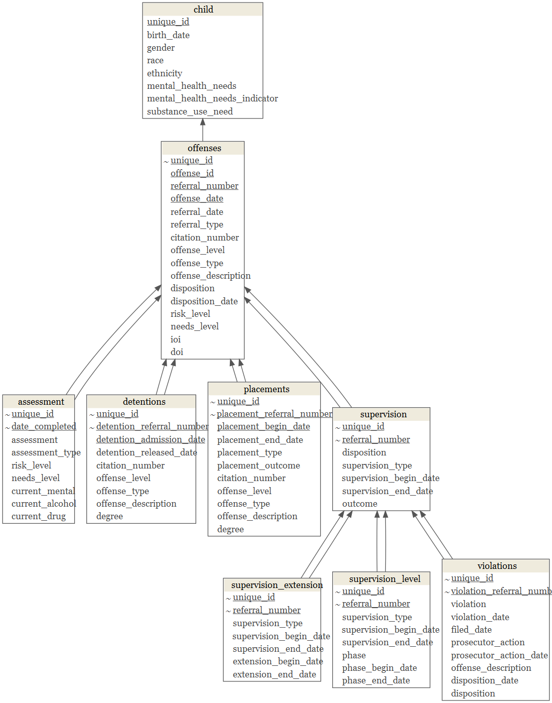

This syntax pulls in all data files provided by Dallas County stored as a series of Excel file tabs -- and preliminarily maps their relationships with the datamodelr package (https://github.com/bergant/datamodelr)

File names reflect the names provided by Dallas County. Find more information on files and variables in `Codebook` tab.

<br>

```{r include=FALSE}
### call libraries
library(easypackages)
libraries("tidyverse","foreign","lubridate","reshape2", "ggplot2","RColorBrewer","knitr","forcats","openxlsx","statar","svDialogs","xlsx", "magrittr","stringr", "data.table","janitor","kableExtra","leaflet", "readr", "rmarkdown","rowr", "gganimate", "gifski","tidycensus","sf","htmltools","acs","tigris","mapview","rgeos", "ggrepel", "censusxy","gdata","lavaan","mclust","tmap","rmarkdown", "raster","rgeos","gmapsdistance","viridis","cowplot","lintr","leaflet.extras","censusapi","data.table","gridGraphics","readxl","haven","ggridges","extrafont","extrafontdb","datamodelr","Lahman","DiagrammeR","fs","readxl","rsvg","V8","ragg","ragg","distill")
```

```{r include=FALSE}
knitr::opts_chunk$set(
  echo = TRUE,
  dev = "ragg_png",
  cache = FALSE
  )
```

```{r out.width="130%",echo=FALSE,message=FALSE,warning=FALSE}

```

